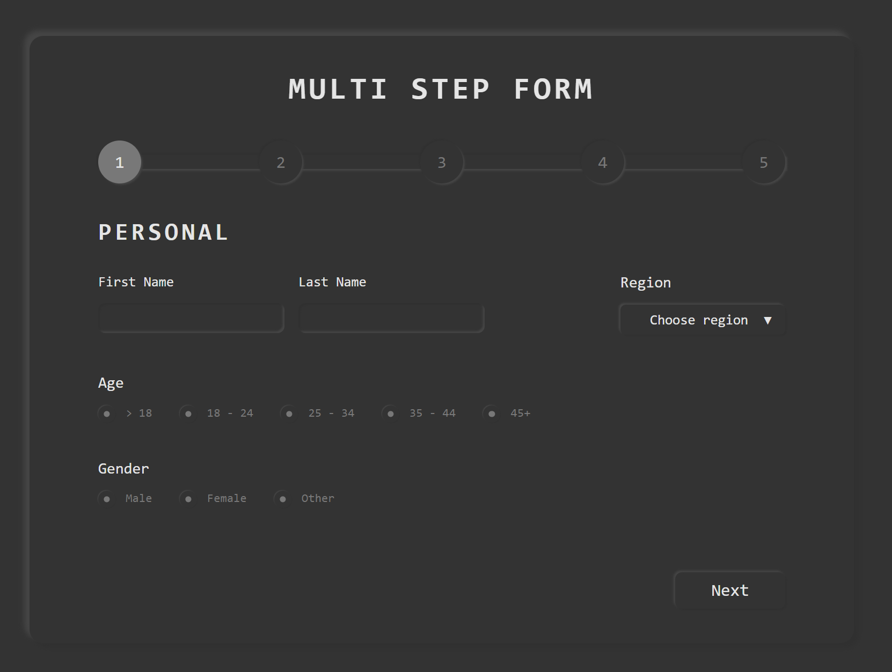

# Multi Step Form

See the live version of [Multi Step Form](https://bartoszdudziak-dev.github.io/task-react-styling/).

A project created for educational purposes during an individual frontend mentoring session. I managed to use several new technologies that allowed me to better understand React library.

**Main features**:
- Reusable components designed with neumorphism
- Client-side validation
- Real-time error handling
- Smooth navigation between steps
- Stepper progress indicator
- Custom inputs and dropdown

&nbsp;
 
## 💡 Technologies

&nbsp;
 

## 💭 Conclusions for future projects

I would like to improve:
- project folder organization
- usage of TypeScript especially custom checkbox and radio inputs
- theming with styled-components

&nbsp;

## 👏 Special thanks
Thanks to my [Mentor - devmentor.pl](https://devmentor.pl/) – for providing me with this task and for code review.